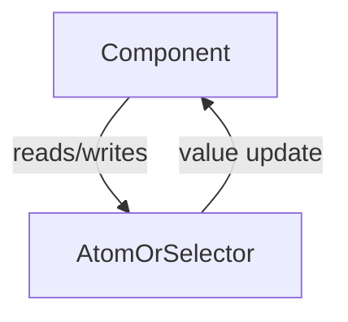

# 📘 React State Management

## ❓ Question 1: What is Redux, and why is it used in React applications? Explain the core concepts of actions, reducers, and the store.

### 🔹 What is Redux?

Redux is a **predictable state container** for JavaScript applications. It helps manage the state of the entire application in a single, centralized store, which makes debugging, testing, and maintaining the app easier — especially when the state grows complex.

Redux is commonly used with React because React components often need to share state across various parts of the app. Redux simplifies this with a unidirectional data flow and centralized state management.

---

### 🔸 Why Use Redux in React?

- ✅ Centralized state: All state lives in a single store.
- 🔄 Predictable updates: State can only be changed via dispatched actions.
- 🧪 Easier debugging: With tools like Redux DevTools.
- 🌍 Shared state: Easily accessible across deeply nested components.
- 💼 Middleware support: Redux can handle async logic with middleware like `redux-thunk` or `redux-saga`.

---

### 🧠 Core Concepts of Redux

#### 1. Store

The **store** is the object that holds the application state. It allows access to the state via `getState()`, updates via `dispatch(action)`, and registers listeners via `subscribe()`.

```js
const store = createStore(rootReducer);
```

---

#### 2. Actions

**Actions** are plain JavaScript objects that represent an intention to change the state. Every action must have a `type` property.

```js
const addUser = {
  type: "ADD_USER",
  payload: { name: "Rahul", age: 23 },
};
```

---

#### 3. Reducers

**Reducers** are pure functions that take the current state and an action as arguments and return a new state. They are responsible for updating the state based on the action type.

```js
function userReducer(state = [], action) {
  switch (action.type) {
    case "ADD_USER":
      return [...state, action.payload];
    default:
      return state;
  }
}
```

---

#### 🔄 Redux Flow

```mermaid
graph TD;
  Component-->|dispatch()|Action;
  Action-->Reducer;
  Reducer-->Store;
  Store-->|new state|Component;
```

---

## ❓ Question 2: How does Recoil simplify state management in React compared to Redux?

### 🔹 What is Recoil?

Recoil is a **state management library developed by Facebook** designed specifically for React. It offers a more React-friendly approach to managing global and shared state using **atoms** and **selectors** with built-in React hooks.

---

### 🔸 Benefits of Recoil Over Redux

| Feature             | Redux                             | Recoil                             |
|---------------------|------------------------------------|------------------------------------|
| Boilerplate         | High (store, reducers, actions)    | Minimal (just atoms/selectors)     |
| Learning Curve      | Steep                              | Easy for React developers          |
| Async State         | Middleware required                | Built-in with selectors            |
| Performance         | Manual optimization required       | Fine-grained component reactivity  |
| Integration         | External to React                  | Native with React hooks            |

---

### 🧠 Core Concepts of Recoil

#### 1. Atoms

Atoms are units of **state**. Components that read from an atom re-render when the atom’s value changes.

```js
import { atom } from "recoil";

export const userState = atom({
  key: "userState",
  default: { name: "", loggedIn: false },
});
```

---

#### 2. Selectors

Selectors are **pure functions** that can compute derived state based on atoms.

```js
import { selector } from "recoil";

export const upperCaseName = selector({
  key: "upperCaseName",
  get: ({ get }) => {
    const user = get(userState);
    return user.name.toUpperCase();
  },
});
```

---

#### 3. Hooks to Use Recoil State

Recoil provides React hooks like `useRecoilState`, `useRecoilValue`, and `useSetRecoilState`.

```js
const [user, setUser] = useRecoilState(userState);
```

---

### ⚖️ When to Use Redux vs Recoil

| Scenario                                     | Choose This |
|----------------------------------------------|-------------|
| Large-scale app with complex middleware      | Redux       |
| Small/medium app with easy setup             | Recoil      |
| Need for devtools/time-travel debugging      | Redux       |
| Want minimal boilerplate & native hooks      | Recoil      |

---

### 🔄 Recoil Flow



---

## 🧾 Conclusion

- Use **Redux** for enterprise-level apps needing strong structure, middleware, and dev tools.
- Use **Recoil** for simpler, modern React apps that benefit from React hook-style state management with less code and complexity.
